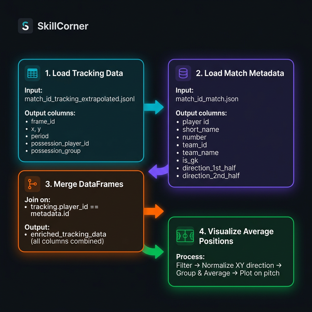

# 🎓 Learning Paths

Welcome to the SkillCorner Open Data tutorials. We've organized our tutorials into logical learning paths to help you navigate from foundational data concepts to advanced analytical workflows.

---

## 🏗️ Path 01: Getting Started with SkillCorner Data
*Focused on the foundational performance data (aggregates) and how to derive immediate insights.*

| Tutorial | Description |
| :------- | :---------- |
| [**Data Normalization Basics**](01_Getting_Started_with_SkillCorner_Data/DATA_NORMALIZATION_BASICS.md) | Understanding P90/P60 normalization and filtering thresholds. |
| [**Multiple Metrics & Z-Scores**](01_Getting_Started_with_SkillCorner_Data/Part2_Multiple_Metrics_and_Z_Scores_Tutorial.ipynb) | Learn how to normalize and compare different mechanical metrics. |
| [**Visualization with SkillCorner**](01_Getting_Started_with_SkillCorner_Data/Part1_Visualization_with_SkillCorner_Tutorial.ipynb) | Master the display of SkillCorner data using high-fidelity visualization techniques. |
| [**Sectioned Summary Table**](01_Getting_Started_with_SkillCorner_Data/Sectioned_Summary_Table_Viz_Tutorial.ipynb) | Create a comprehensive table comparing players across multiple metric categories. |

---

## 🧠 Path 02: Working with Game Intelligence & Dynamic Events
*Deep dive into the contextual data layers that define the narrative of a match.*

| Tutorial | Description |
| :------- | :---------- |
| [**Aggregating Dynamic Events**](02_Working_with_Game_Intelligence_and_Dynamic_Events/Open_Data_Aggregating_Dynamic_Events_Tutorial.ipynb) | Summarize and process SkillCorner dynamic event categories. |
| [**Aggregating Phases of Play**](02_Working_with_Game_Intelligence_and_Dynamic_Events/Open_Data_Aggregating_Phases_of_Play_Tutorial.ipynb) | Using the PHASES OF PLAY framework to understand match context. |
| [**Merging Events & Tracking**](02_Working_with_Game_Intelligence_and_Dynamic_Events/Open_Data_Merging_Dynamic_Events_and_Tracking_Data_Tutorial.ipynb) | Synchronizing discrete event data with continuous tracking streams. |

---

## 📍 Path 03: Basics of Tracking
*The core of SkillCorner: working with raw X/Y coordinates and spatial data.*

| Tutorial | Description |
| :------- | :---------- |
| [**Tracking Core Tutorial**](03_Basics_of_Tracking/Open_Data_Tracking_Tutorial.ipynb) | Loading raw JSONL tracking data and visualizing fundamental positioning. |
| [**Kloppy Integration**](03_Basics_of_Tracking/Open_Data_Getting_Started_with_Tracking_and_Kloppy_Tutorial.ipynb) | Using the industry-standard Kloppy library for data standardization. |

---

## 🎨 Featured: Tracking Open Data Pipeline

